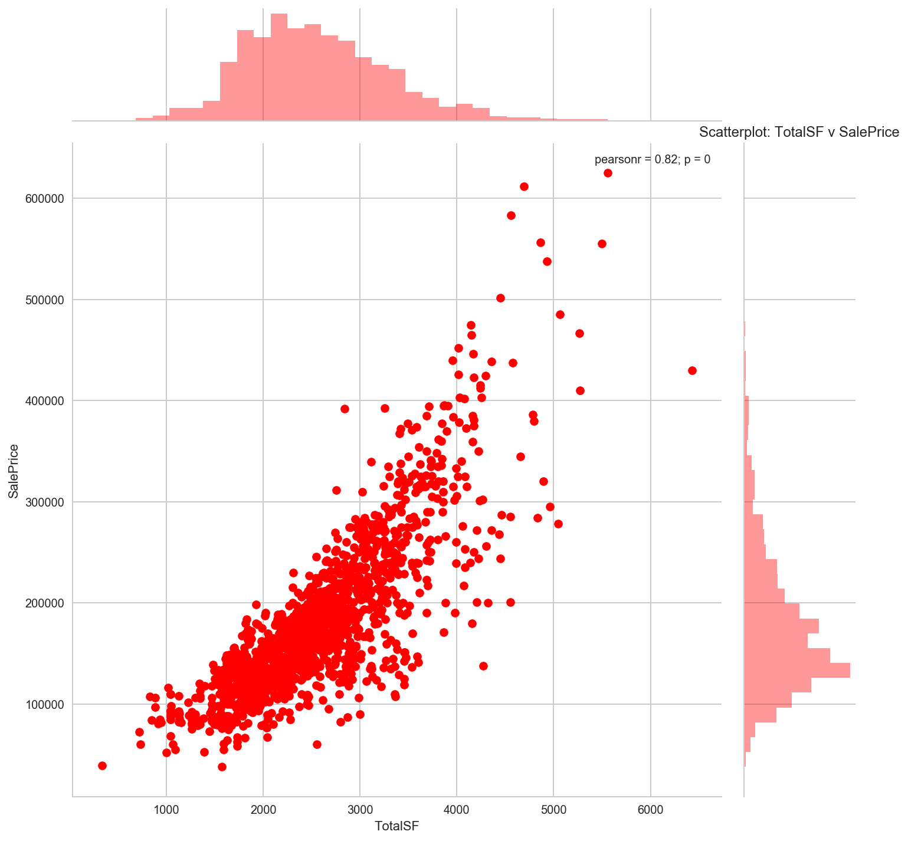

Welcome to the landing page for Tom's personal github account.

Tom Croshaw is a research analyst turned data scientist with a keen interest in the natural environment, science and of course... **Data!**

---

## Can Social Data Predict Severe Natural Catastrophes?
_April - June 2017_

This project is an investigation into how Twitter data can be used to predict major natural catastrophes. Specifically, can social data help us determine whether:
- There will be a large financial loss
- A significant number of insurance claims will be received
- A large area will be impacted by the event

This investigation was my Data Science Immersive Capstone Project at General Assembly, Sydney. Please follow the link below to view the progress of the analysis:

### [Investigation Blog](/capstone/index.md)

---

## Property Sales Price Regression Analysis
_September 2017_

This project is an investigation into how property attributes data can be used to predict sale price. It tackles the analysis from the perspective of an investment company and uses the Ames, Iowa Housing dataset to compares the impact of fixed, permanent property features to those that can be changed (i.e.: renovation potential).

### [Analysis Report](/ames_housing_data/index.md)

---
