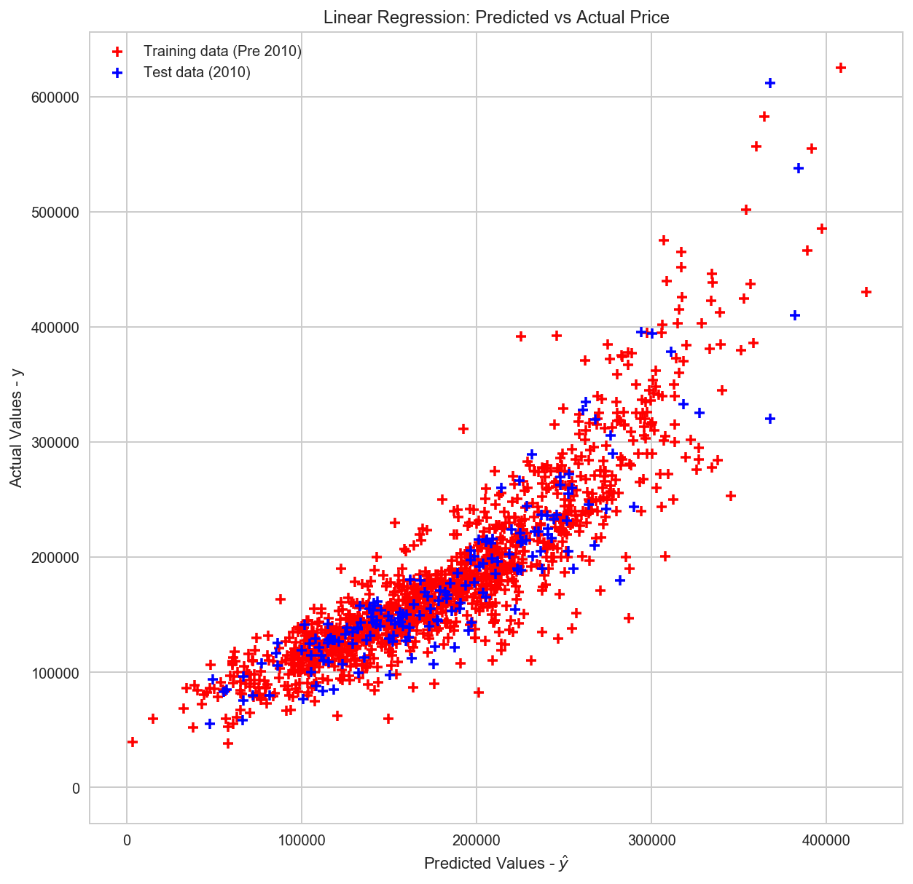

# Predicting Property Sales Prices using Ames Housing Data

The Ames Housing Dataset was compiled by Dean De Cock and it is a common dataset used for data science education. It contains 80 explanatory variables describing aspects of residential homes in Ames, Iowa. The goal of the analysis is to predict property selling price using regression.

This project was undertaken from the perspective of an investment company that wants to use statistical analysis to optimize investment and maximize return. The analysis had two components:
- to investigate the impact of fixed characteristics, such as constructio and location, on sale price
- to investigate the impact of changeable characteristics, such as feature quality, condition, and renovation potential, on sale price

### Analysis Results

The fixed variables were found to be the most predictive property attributes for sale price. 

The fixed variable model uses multiple linear regression that identifies the following variables as the most predictive of sale price. They are ranked in terms of their absolute (lasso) coefficients:

- Total Square Foot: 33458.162931
- Year Built: 12568.177256
- GF Living Area: 9852
- Garage Area: 8389
- Fireplaces: 7205
- Garage Year Blt: 5034
- Bathrooms (Number) Total: 4157
- Lot Area: 3610
- Garage Car Spaces: 3507
- Lot Frontage: 3116

The coefficient of determination of this model for the train/test data (pre/2010 sales) is:

- Train: 0.7876
- **Test: 0.7912**

Ridge and Lasso regression were then performed on the training data to see if they improved the R^2 of our linear regression:

- Ridge: 0.7912
- Lasso: 0.7939

There is only minor improvement with both regularisation techiques, which indicates variables cannot be significantly penalised (i.e.: their magnitudes cannot be significantly reduced) to improve model performance, and there is little overfitting.

The changeable feature model has an R^2 value of 0.273. These features alone are unable to confidently predict sale price although some interesting insights on the types of property features that produced the most significant coefficients were observed...

To review the results of this analysis in greater detail in the technical notebook please follow this link:

_[Technical Notebook](https://github.com/tcroshaw/ames-housing-analysis/blob/master/ames_analysis_notebook.ipynb)_

_[Back to Homepage](https://tcroshaw.github.io/)_
