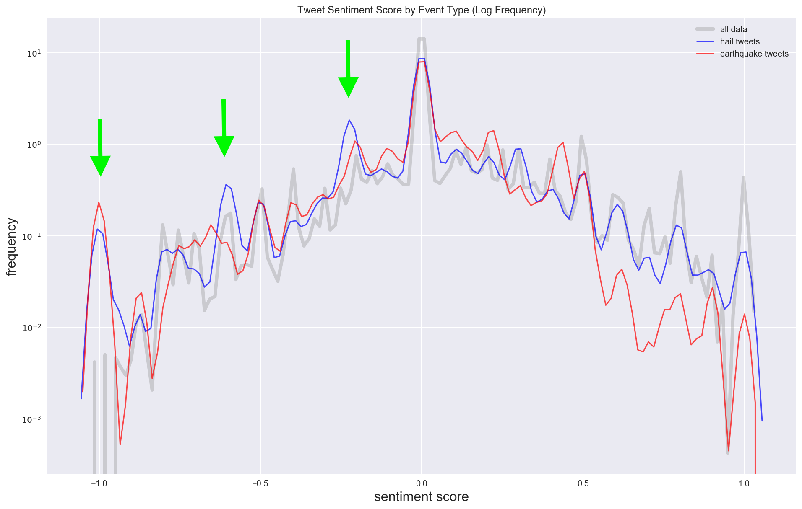
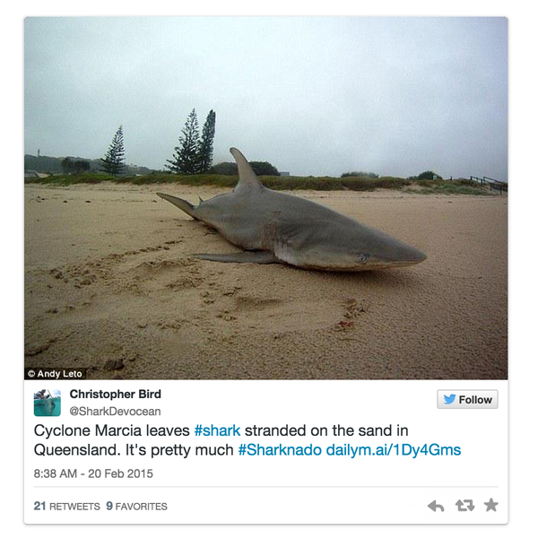

# Can Social Data Predict Severe Natural Catastrophes?

## 13th April 2017 - Setting the Scene: A Catastrophic Twitter Analysis

**Project Introduction**

The main objective of this project is to develop a model that can predict a natural catastrophe from social data. 

I will use natural language processing to analyse social posts and investigate which machine learning algorithms generate the most robust models to prove my hypothesis that language, volume and interconnectivity of social posts can indicate a significant catastrophe is occurring. 

The factors that determine a natural 'catastrophe', particularly from an insurance perspective, include financial/insurance loss, the number of claims or damage reports and the geographic extent. These will be the key indicators of catastrophic loss I hope to get from the model.

The study will focus on analysing **Twitter data** for major Australian **hail storm** events. I have selected two events for my analysis:

- Brisbane Hail Storm (27th November 2014): AUD 1,400m insurance loss
- Sydney Hail Storm (25th April 2015): AUD 400m insurance loss

I have chosen these events as they are two of the largest hail insurance losses since the age of Twitter and their catastrophic loss attributes (loss, claims and geography) are significantly different.

The specific goals of this investigation can be outlined in two main questions:
- Can twitter data detect hail events from the language people use in tweets?
- Can twitter data identify catastrophic hail events of differing severity?

To introduce you to my project, please follow the link to the slide deck of my 3 minute project pitch.

__[Capstone Part-01 Presentation](https://github.com/tcroshaw/GA_DSI_Capstone/blob/master/part-01/tom_part_01_presentation.pdf)__

This project was performed as part of General Assembley's Data Science Immersive Capstone. The initial deliverable was to choose a topic and problem, describing your goals & criteria for success, potential audience(s), and identifying 1-2 potential datasets. The format to present this information was a slide deck and Pecha Kucha format, 3 slides in 3 minutes! This was a lightning fast introduction to our project and it provided a valuable opportunity to train our thoughts into what the success criteria of our projects will be and how the analysis could be structured.

Now that the project is pitched, I will begin exploring my data further and report back with my findings.

------

## 5th May 2017 - Brisbane Hailstorm - A Preliminary Exploratory Data Analysis

In this stage of the investigation I will refine the problem statement, deliverables and perform an exploratory data analysis on my main Twitter dataset, the Brisbane Hailstorm.

The specific goals of this project are to:

- Identify language in tweets that confirms a specific type of catastrophe is occuring (i.e.: a hail storm)
- Identify language in tweets that suggests damage to property or infrastructure is occuring as a result of the event
- Recognise sentiment in tweets that indiciates a _severe_ event is occuring (extreme words such as "massive" or "terrifying")
- And ultimately... build a model that can effectively classify tweets that indicate a catastrophic event...

*Note that at this stage the target variables for classification are still under investigation. Part-03 will refine my modelling approach...

## Project Methodology

 **Data!**

The historical twitter data were sourced from _Sifter_. Sifter is a service that provides search and retrieve access to every undeleted Tweet in the history of Twitter.

https://sifter.texifter.com/

For this project I obtained two datasets:

**Primary dataset: Brisbane Hail Storm** With guidance from Sifter, I performed the following search function to extract the data:

_Rule: (contains hail OR storm OR damage OR flood OR insur OR "golf ball"~6 OR "tennis ball"~6 OR lightning OR thunder OR #brisbanehail OR #brisbanestorm OR "brisbane hail"~6 OR "brisbane storm"~6 OR #australiahail OR #australiastorm OR "australia hail"~6 OR "australia storm"~6 OR #auhail OR #austorm OR "au hail"~6 OR "au storm"~6 OR #qldhail OR #qldstorm OR "qld hail"~6 OR "qld storm"~6 OR #queenslandhail OR #queenslandstorm OR "queensland hail"~6 OR "queensland storm"~6 -(brisbane OR qld OR queensland OR australia OR au OR seqld) All duplicates removed._

The data query aimed to capture all potential tweets that relate to the hail event on 27th November 2014. I extracted 3 days worth of data however I will only analyse a 24 hour period either side of the time the hail occured (15:00 - 17:00 AEDT) as I am primarily interested in 'real-time' indicators.

Because this event impacted a larger geographical area and produced a higher insured loss, I will use this as my primary dataset for the exploratory model development.

**Secondary dataset: Sydney Hail Storm** I performed a similar search in Sifter to gather data for a hail event in Sydney on 25th April 2015.

_Rule: (contains hail OR storm OR damage OR flood OR "golf ball"~6 OR "tennis ball"~6 OR insur OR lightning OR thunder OR #sydneyhail OR #sydneystorm OR "sydney hail"~6 OR "sydney storm"~6 OR #australiahail OR #australiastorm OR "australia hail"~6 OR " australia storm"~6 OR #auhail OR #austorm OR "au hail"~6 OR "au storm"~6 OR #nswhail OR #nswstorm OR "nsw hail"~6 OR "nsw storm"~6 -(sydney OR nsw OR "new south wales" OR australia OR au) All duplicates removed._

**Supporting dataset: ICA Catastrophe Data 2016** This dataset was sourced from the Insurance Council of Australia (ICA). "The ICA collects catastrophe related claims data from the Australian market as part of its role in supporting the industry to deliver repairs, rebuilding and recovery services following large disasters. The ICA Catastrophe Database commenced in 1967 and records insurance loss estimates for declared insurance catastrophe events." (ICA Wesbite)

This dataset will be used as a reference for the two major hail events in 2014 and 2015. It will also serve as a useful guide for future events to investigate.

Natural Language Processing:
I will use natural language processing techniques to analyse the actual tweet of each twitter record. Specifically I will use NLP to:
- Remove regular expressions, segment tweets and perform other cleaning operations (expanded in part-03 of project)
- Perform word pattern matching and frequency analysis
- Topic Clustering
- Analyse sentiment of the tweets (later on in Capstone).

Machine Learning:
Once I have determined the types of target I will need for my model, I will test classification algorithms and modelling techniques to observe which model produces the optimal results. Some  algorithms that are tradtionally good for text classification are Naive Bayes, Decision Tress and Stocatistic Gradient Descent. I will discuss the most appropriate methods further in part-03 of the blog.

**Exploratory Data Analysis - Key Insights**

Now that I have performed my preliminary EDA I will share some interesting observations of the 24-hour Brisbane Hail data...

When investigating the devices used to produce these tweets I notice a strange source that produced the greatest number of tweets over the 24 hour sample.

**Twittascope!!??**

Taken from Twittascope website: "About Twittascope.com: Twittascope tweets authentic horoscopes for your Twitter account each morning. Provided by the Daily Insight Group, this leading horoscope service offers a daily dose of astrological insight."

This does not sound like a reliable resource for investigate tweets on natural catastrophes (!), so although this is a large sample of data it will exclude it from our project.

After I cleaned the data of all unreliable tweets, removed outliers and replaced null values, I investigated the frequency of the term 'hail' over the 24 hour period...

The above frequency distribution over the 24 hour period shows signficiant spikes in the use of 'hail' in tweets at 6 - 8 AM GMT, which is 3 - 5PM Brisbane Daylight time. This corresponds with the known time of the major hail event in Brisbane. Another peak occurs later in the series - what could this relate to? Was there another hail event elsewhere..?

Now we know the Brisbane hail event is strongly recognised in our data, what other terms are the most prevalent when this word was tweeted?

The above graph shows the key words that were posted in tweets that contained the word 'hail'. Location information such as Brisbane and Australia are observed, as well as emotive words such as "massive, super, worst", all of which will be critical in the tweet classification process and sentinment analysis in later phases of the investigation.

_Could 'golf' and 'ball' be related..?_ It is common to associate hail size with objects, particularly common with objects such as "golf-ball" or "tennis-ball". I will therefore include a bigrams NLP investigation in later stages to see if this term is signficiant.

**Next steps:**

The next stage of the investigation will refine the NLP processes by continuing to look at groups of key words and investigate topic modelling. I will then trial different algorithms to .

---

## 17th May 2017 - NLP Continued, Preliminary Modelling and... Another Type of Catastrophe?

This update will highlight the main results of the investigation so far and discussion on my approach.

**Analysis Methodology**

The approach to my analysis so far can be broken into four main sections:

_Data Cleaning_

In the preliminary EDA I found that cleaning user information was an important step to improve the confidence of the twitter records. In particular, removing anomalous records and removing outliers ensures records from misleading media, automated tweeting services or 'bots' are removed.

The Sydney hail event has now been integrated and processed with the Brisbane hail event in a single dataset. This ensures consistency in data engineering.

_Bag-Of-Words Analysis:_

As discussed in my previous update, tokenisation, stop-word removal and other natural language processing techniques are critical steps in this project. The final output is a vectorised dataframe of all key words communicated in tweets. Vectorisation also allows potential targets to be created for classification modelling (i.e.: using the 'hail' word use as a class). This analysis shows a clear skew of word counts to low frequency, as expected, however some words are prevalent throughout tweet samples due to the volume of tweets on specific subjects (i.e.: the hail events). 

Comparing the words that occur in each hail event is been crucial in supporting my idea that twitter can identify natural catastrophes of significance... So much so that another type of event was indentified!

The highest correlated words are: quake, hits, big and Nepal... We can now deduce that the twitter data also picked up another major natural catastrophe: the Nepal Earthquake on 25th April 2015!

This discovery provides validation of the searching method and shows that this process can identify more than one type of natural disaster. This increases the scope of the project as well as future applications.

A geographic analysis of the tweet data found a concentration in 'hail' tweets over Texas. Research found there was another hail event that also occurred on 25th April 2015 in San Antonio, causing hail storms of up to 2 inches. There is little evidence to suggest this was significantly damaging but could explain the rise in hail tweets in the latter hours on 25th April 2015 data.

_Topic Modelling_

Latent Dirichlet Allocation (LDA), a statistical model for discovering "topic" clusters that occur in a collection of text records, has helped identify the core groups of words in our data. Grouping the data by location and enables powerful analysis of the key terms that occur together and by narrowing the dataset into regions which are specific to the hail events, words indicating hail are more strongly recognised.

The above graph displays the LDA results, which recognise a hail event and two other topics:
- 1. The Nepal Earthquake and 2. a very poor performance by the Melbourne Storm against the Manly Sea Eagles on 25th April 2015.
- Other events identified over these dates were the thanksgiving period in 2014 (and the associated poor travel weather!) and tweets concerning Boko Haram.

_Preliminary Algorithm Development_

Whilst modelling is still in its early phase, I have identified that classification algorithms are the most appropriate models for text analysis. Initially I have investigated logisitic regression and decision tree algorithms. Words indentified during the Bag-of-Words analysis / topic modelling that indicate hail are extracted as predictors and a hail 'class' has been generated as the target variable. My preliminary investigation uses the Brisbane Hail data to train the algorithms.

Overall the decision tree classification provides a slightly higher accuracy score than the logistic regression (the coefficients plotted on the bar graph above). Both models have coefficients of determination (R^2) of greater than 0.9 however only predict ~18% of our known positive hail classes. This suggests a more robust feature selection process (including a Principle Component Analysis) and further algorithm testing must next be performed to improve model performance.

**Lessons Learned from this stage of the project:**

- Dealing with null values and removing outliers appropriately are important however there is a trade-off between improving the distribution of a variable and knocking out too much data.
- Natural language processes and the sequence in which they are performed are very important when analysing text data, particularly 'messy' data such as tweets.
- Bag-Of-Words and topic modelling is useful for indentifying major themes, however using this to limit predictors in text classification potentially reduces algorithm precision. Despite the high accuracy of our preliminary models, feature selection must be more robust to improve model performance.
- Other algorithms may be more appropriate for this project and further testing will ensure the most effective machine learning methods are used.

The next stage of the project will include feature selection and Principle Component Analysis. I will also investigate other classification models: Naive Bayes and ensemble methods in particular and analyse the sentiment of the tweets...

-----

## 6th June 2017 - Catastrophe Classification Models: Development and Results

This stage of the project extends the analysis completed so far into a final delivery that includes sentiment analysis, a principle component analysis and an optimal classification model.

***Sentiment Analysis***

During severe natural catastrophes, people generally tend to tweet emotive language to describe the events they're experiencing.

_Textblob_ is python library for processing textual data. The _sentiment_analysis_ function returns a 'polarity score' - a measure of the negativity, the neutralness, or the positivity of the text. This function was parsed over all tweets to understand how sentiment varis for different catastrophe types.

The sentiment results suggest that for the most negative polarity scores, the relative frequency of earthquake and (lesser so) hail tweets are greater than all tweets. The inverse is seen at positive sentiment scores, particularly for earthquake.

Three major peaks are observed for negative scores at -0.25, -0.6 and -1.0 where either the hail or earthquake tweets exceed the frequency for all-tweet negative sentiment and in general, there are very few points where the negative sentiment of all tweets exceeds either catastrophe. This indicates that sentiment could be an indicator of catastrophic events and as such, this feature is used as a predictor in the modelling.

***Principle Component Analysis***

A Principle Component Analysis was performed to investigate whether a smaller number of uncorrelated variables represent a large amount of variance in the dataset, and as such, whether the multicolinearity could be reduced by limiting the number of variables. All word predictors were assessed (995 in total once location and hail references were removed) in the principle component analysis to review the dimensionality.

The main conclusions of the PCA are:
- The maximum variance explained for any component is 1.2%, which is generally low but considering the number of variables, it is fairly significant.
- The individual explained variance graph (below) suggests all components explains _some_ of the variance.

- The cumulative variation suggests that if we only wanted to retain 90% of the variance, ~800 components would still need to be retained in the modelling.
- When investigating the predictors that contribute to the top-6 components, no single predictor contributes significantly to the component's overall variance apart from PC1 and the word 'wolf'.

The conclusion is that there is little evidence suggests that removing components would signficantly reduce dimensionality enough to improve model performance. Therefore all predictors were used in the final model development.

***Classification Algorithm Investigation***

**1. Hail Modelling**

A random forest classification algorithm was found to be the optimal model for the hail class target. The principle component analysis did not suggest that limiting components would be effective in reducing dimensionality, therefore all predictors (i.e.: words in the vectorised, normalised data) were used in modelling. Naive Bayes, Stochastic Gradient Descent and Decision Trees all provided high accuracy scores but their f1 scores, the harmonic mean of precision and recall, were less than the random forest classifier. Each model's f1 scores are driven by the recall value of the hail-class prediction - see the ROC curve below for overall classification performance of each tested model. When the random forest classifier was optimised via gridsearching and fit with 100% of the data, thee recall increased to 0.82; a very positive result for the ability of tweets to predict hail.

_A note on ROC Curves:
The **Receiver Operating Characteristic** curve is a plot of the true positive rate against the false positive rate of a diagnostic test. The Area Under the Curve (AUC) is a measure of the classification accuracy: the closer the curve follows the left and top border of the ROC space, the more accurate the test._

**2. Severity Modelling**

When the optimised model is trained/tested using the two events (i.e.: trained with the Brisbane data then tested with Sydney), the classification results were poor despite their high accuracy scores. This indicates that the tweets in each events use different language to communicate the hail. 

A subsequent classifiction analysis was performed that extracts the hail only records from the overall sample, then uses the event to create a target class. The result of this analysis is a moderately strong classification with a R2 score of 0.81 and true positive rate of 66% for severe events. An analysis of the model's feature importance reveals common words used to describe severe events (chaos, slammed, worst) as the predictors with greatest influence on the model's class prediction.

These results suggest that the language used in the severe and moderate event differed and can predict a severe event reasonably well.

**3. Multiple Catastrophe Classification**

A final analysis then introduced **earthquake** as an additional class with hail. This produces a high accuracy score of over 0.95 and strong classification metrics, particularly for earthquake. 

The poor performance of hail in this model suggests that indepenent classification models for each natural peril are likely optimal over a combined catastrophe classification. It also implies that the language used in earthquake tweets is more indicative of that type of catastrophe rather than hail. It is likely that an independent earthquake classification algorithm will perform well alone although further investigation is needed to prove this.

---

**Stakeholder Recommendations and Next Steps**

The following recommendations will improve this analysis prior to model deployment:

1. Introduce more hail events to strengthen the classification model. More mid-tier events (i.e.: between the Sydney and Brisbane magnitude of loss) and more transitional events (<100M AUD) would allow us to make more confident conclusions about the terms driving severe event classification.
2. Create a method that infers location from text and investigate clustering with known tweet location data. This would significantly improve the number of coordinates and tweet locations.
3. Investigate sentiment analysis for the specific events - does polarity differ for more/less severe events?
4. Further algorithm analysis should be performed. This includes more intensive training/testing of data beyond the 50/50 split for the current algorithms and looking at others such as SVM.
5. Investigate other types of natural catastrophe. Earthquake was already identified but bushfires, floods and cyclones are also very common in Australia.
6. Investigating alternative data sources could enhance this analysis. Text classification of facebook posts and image recognition of instagram posts are other potential social resources.

**Model Deployment:**
The following diagram outlines a potential deployment framework for the classification model:

Check back next week for the final presentation and closing words...

---

## 9th June 2017 - Summary and Final Presentation

To close this blog off I will summarise how well the analysis delivered the project goals...

***Can twitter data detect hail events from the language people use in tweets?***

The hail events were successfully identified at multiple stages of the analysis:
 - NLP identifes words that relate to the hail events in question and record significant activity during the known time period of each event.
- Topic modelling produces strong clustering of words that relate to the hail events, particularly when subsets of the data were analysed specific to the time periods of each storm.
- Sentiment analysis records negative polarity of hails tweets exceeding the frequency of all-tweets. This aligns with common understanding for negative, extreme language during natural disasters.
- The hail modelling also produces a number of very promising results. The predictors trained a random forest classification algorithm that accurately predicted ~80% true positives of known positives. The presicion and recall of the model increase with training size and with further samples for more types of hail events, it will likely improve further.

***Can twitter data identify severe catastrophic hail events?***

Knowing the impact of the Brisbane and Sydney hail events allowed us to draw some conclusions on how well language recognises more damaging catastrophes. There were a number of results that correctly identify the more severe event:
- NLP recognises language that relates to severity, specifically the bag-of-words analysis and topic modelling of each event.
- Training and testing the optimal hail algorithm using each event suggests there is significant difference in the predictors that drive hail classification in each case.
- The event classification produces positive results when predicting different severities, reinforcing the difference between events. The predictors that drive this classifciation are words that indicate extreme events such as _chaos, massive, super and slammed_.

***Extension... Can twitter data identify other types of catastrophic events?***

The discovery of the Nepal Earthquake was a positive confirmation of our search criteria and NLP process. It also allowed us to broaden the scope of the project into a third modelling investigation. The combination of earthquake with the hail class provides a promising result for the second peril and suggests that tweets can effectively recognise earthquake events without the term existing, likely due to such specific terminology commonly used for that type of disaster such as _magnitude and hits_.

---

A final note... Another natural peril in Australia is cyclone. If terms unique to this peril show up in tweets, like the incredible '#sharknado in Queensland's Cyclone Marcia in 2017, the potential to develop predictive algorithms for this and other catastrophes is very strong! 

---

The final presentation was given to the Data Science Immersive cohort at General Assembly on 9th June 2017. To view the slide deck please use the following link...

_[Final Presentation](https://github.com/tcroshaw/ga-dsi-capstone/blob/master/final-presentation/capstone_part05_presentation.pdf)_

You can also view the presentation on the General Assembly Sydney facebook page (DSI2 Part 3 video) at:

_[General Assembly Facebook page](https://www.facebook.com/GeneralAssemblySydney/)_

For those who would like to delve deeper into the technical components of the project, please feel free to review the final jupyter notebook on my Githib page:

_[Technical Notebook](https://github.com/tcroshaw/ga-dsi-capstone/tree/master/technical-report)_

Please feel free to reach out to me via LinkedIn or twitter for more information on this analysis.

_[Back to Tom's Homepage](https://tcroshaw.github.io/)_
