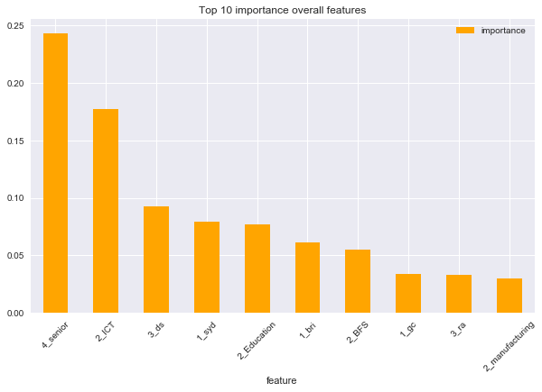
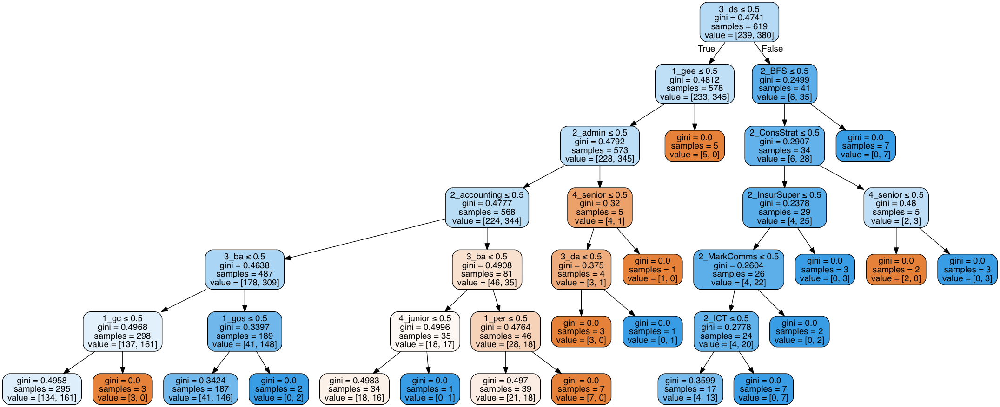

## Predicting Salaries of Data Jobs in Australia

#### *An investigation into what attributes impact salaries of data jobs.*

This investigation set out to identify the key characteristics of data and research jobs that influence salary. Firstly a web scraping exercise was performed that sourced 3000 records from https://seek.com.au. This was performed using BeautfifulSoup and Requests by accessing key components of the html code. The jobs searched were: 
- Data Science
- Data Analyst
- Business Analyst
- Research Analyst
- Research Scientist

The key information captured form scraping includes the job title, salary, location, industry and description. Once enough data was collected it was cleaned prior to modelling.

***Data Cleaning and Exploratory Data Analysis:***

The job info data needed significant manipulation prior to modelling. This included the following:
1. Creating dummy columns for industry, location and job title (extracting role name and level/seniority). Dummy column creation is critical to ensure this information can be used for modelling.
2. Cleaning the salary field: this was a lengthy process due to many characters and formats. An annualised version of available salary data was derived, with the assumption that candidates would get paid the maximum salary in any range (a very positive assumption!)
3. Extracting key skills from job descriptions: to do this, natural language processing was used, including CountVectorisation, to produce a dataframe of all recorded words (removing stop words). To reduce this further, a precompiled list of key data/research skills and requirements was used to filter the dataframe.
4. Salary outliers were removed to improve the distrubtion of our target variable.

These processes resulted in a final dataset of 620 records; a significant reduction but an appropriate one. Of this sample, the exploratory data analysis (EDA) found other interesting insights:
- **Role Type**: Data Scientists have the highest median salar and a moderate salary range. Business Analysts, close behind, also have the largest interquartile range and research analysts have the lowest median salary.
- **Seniority**: Managers have the highest median salary although Senior levels are less than $10,000 behind.
- **Location:** Sydney has the widest range in job salaries although the highest median salary location is in Canberra.
- **Industry**: Insurance and Superannuation' has one of the largest ranges in job salaries and the highest median salary of all industries. Overall 'Sales' has the highest IQR but the lowest median, yet also the highest salary (likly distorted by the small sample size).

Preliminary results indicate that the predictors do not perform well in regression models when attempting to predict the actual salary. However when the analysis is reframed as a classification exercise, predicting high vs. low salary classes, the models have much higher accuracy (an R^2 of 0.67). 

Key features that determine higher salaries include senior and managerial positions in data science, particularly in Sydney and the Gold Coast. Banking and Finance and ICT industries have high paying roles and the main technical skills for the high-paid jobs include research and development, SQL, science and entrepreneurial skills. Data Scientists and Data Analysts were the role types that commanded the highest salaries.

### What makes a good data scientist?

An extension to the salary analysis looked at which locations, industries and key skills are able to specifically classify a 'data scientist' position. My hypothesis was that technical skills such as python and SQL will be more important when classifying a data scientist role than the location and industry of the position. 

Decision tree and logistic regression classifications were used in this investigation.

Decision Tree Classification: A very high accuracy with this model was observed, a R^2 of > 0.9. 
-	Key skills were in line with common data science proficiencies; learning, python, scala. 
-	The most important non-‘skill’ feature is a job in the Insurance industry.

Logisitic Regression: Another very high accuracy with this model - R^2 of > 0.95. 
-	Key skills also in line with common data science roles; python (on top!), learning, predictive (analytics) and data. 
-	The most important non-skill feature is a role in the Science and Technology industry.

With these very accurate models and many of the same skills and predictors placing high on the feature importance/predictive coefficients, we can confidently say that technical skills determine data science roles more than job industry.

A final investigation looked at whether a job location and key skills could classify data jobs in certain industries. The results of this analysis, and the technical notebooks detailing the webscraping, natural language processing and predictive modelling can be found on my github page with the following link:

_[Analysis Notebook](https://github.com/tcroshaw/data-jobs-analysis/blob/master/data_job_salary_prediciton_analysis.ipynb)_

_[Web Scraping Notebook](https://github.com/tcroshaw/data-jobs-analysis/blob/master/data_job_salary_prediciton_analysis-web_scraping.ipynb)_

_[Back to Homepage](https://tcroshaw.github.io/)_
